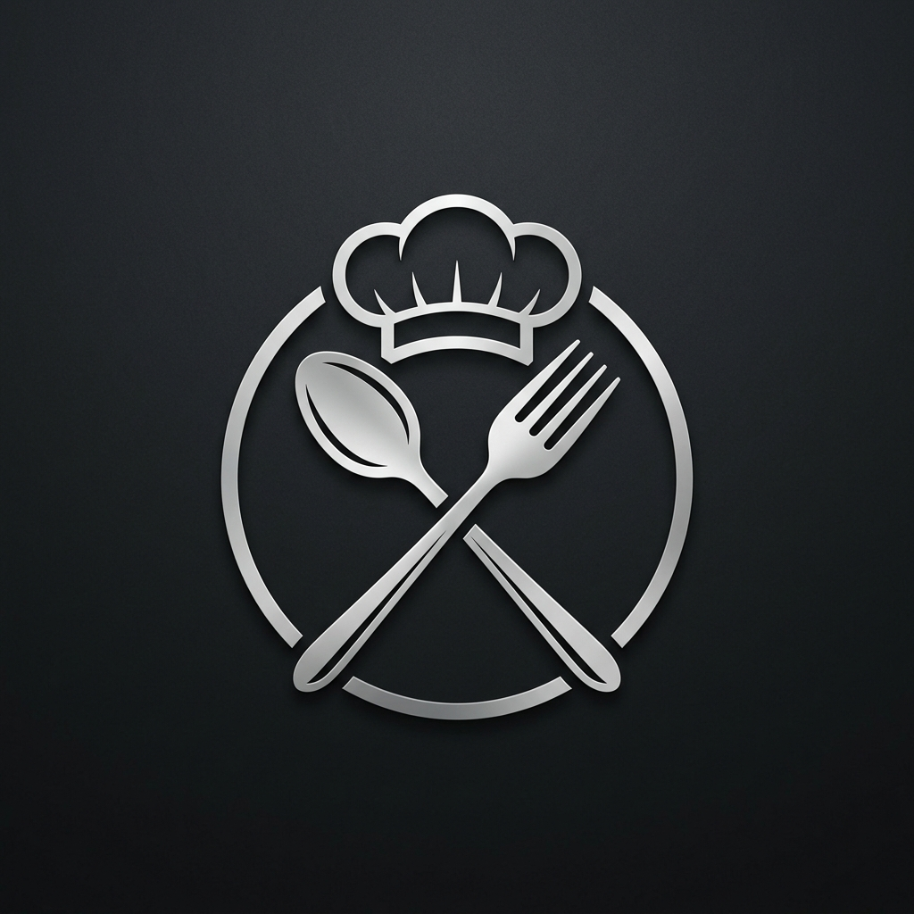

# SmartChef AI: Your Culinary Intelligence

<p align="center">
  
</p>

> **Built for the Oxlo AI Hackathon** — Revolutionizing the way we cook with high-precision AI and cinematic food photography.

SmartChef AI is a premium, visual-first culinary assistant designed to eliminate pantry waste and spark kitchen creativity. Unlike generic recipe generators, SmartChef uses the high-performance **Oxlo AI API** to craft recipes tailored strictly to the ingredients you already have, complete with stunning, cinematic photography of the final dish.

---

## Key Features

### The "Fridge Raider" Engine
Powered by **Llama 3.2-3b** via Oxlo AI, our generator follows a strict "No Hallucination" policy. It analyzes your unique pantry inventory and crafts professional recipes that utilize what you have, supplemented only by basic kitchen staples (salt, oil, pepper).

### Cinematic Plating
Every recipe is born with its own high-accuracy hero image. Using **Flux.1** via Oxlo, SmartChef generates specialized prompts that incorporate your specific ingredients and dietary preferences to create a high-end, studio-lighting photograph of your meal.

### Global Accessibility
SmartChef is built for a global audience. With integrated **Multilingual Support**, users can generate full recipes in 10 major world languages, including Spanish, French, Arabic, Chinese, and Japanese, with real-time AI translation.

### The Recipe Vault & Export
Never lose a masterpiece. SmartChef features a persistent "Vault" to store your culinary history locally. Need to take it offline? Use the **Business-Ready Export** to download recipes as text or print them in a clean, professional PDF format.

---

## Tech Stack

- **Framework**: [Next.js 15](https://nextjs.org/) (App Router)
- **AI Core**: [Oxlo AI API](https://oxlo.ai/) (Llama 3.2 & Flux.1-Schnell)
- **Styling**: Vanilla CSS with a focus on Glassmorphism and Premium Dark Aesthetics
- **Icons**: [Lucide React](https://lucide.dev/)
- **Data Persistence**: LocalStorage API for seamless client-side history

---

## Installation & Setup

1. **Clone the repository**
   ```bash
   git clone https://github.com/Rampop01/SmartChef.git
   cd SmartChef
   ```

2. **Install dependencies**
   ```bash
   npm install
   ```

3. **Configure Environment Variables**
   Create a `.env.local` file in the root directory:
   ```env
   OXLO_API_KEY=your_api_key_here
   OXLO_MODEL=llama-3.2-3b
   OXLO_API_URL=https://api.oxlo.ai/v1/chat/completions
   ```

4. **Launch the Studio**
   ```bash
   npm run dev
   ```

---

## Design Philosophy
SmartChef was built with a **Visual-First** philosophy. We believe that we eat with our eyes first. The UI features:
- **Glassmorphic Panels**: For a modern, high-tech kitchen feel.
- **Ambient Glows**: Using dynamic radial gradients that shift to create a professional studio atmosphere.
- **Micro-animations**: Subtle interactions using CSS transitions and Framer-inspired logic.

---

## License
Distributed under the MIT License. See `LICENSE` for more information.

---

**Developed with Oxlo AI.**
